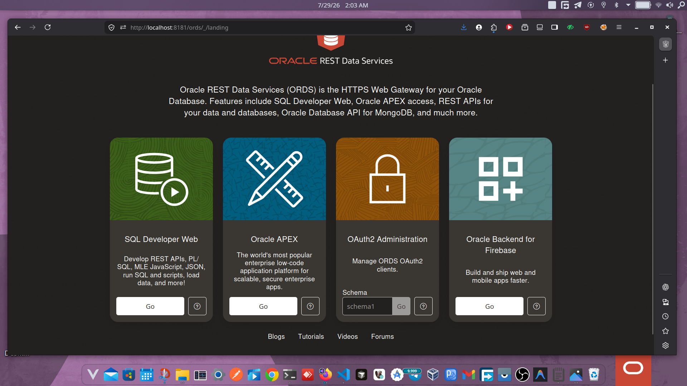

# Oracle Backend for Firebase Installer & Toolkit

A standalone, cross-platform, production-ready installer and toolkit that automates the Oracle Backend for Firebase 26.1 installation, configuration, verification, repair, and rollback workflow.

This project is designed to be executed against an **existing** Oracle environment.



## Features

- **Automated Preflight:** Validates database compatibility, string sizing, TDE configuration, and ORDS availability.
- **Idempotent Installation:** Safe to run multiple times. Skips what is already configured.
- **Built-in Verification:** Comprehensive post-installation health checks.
- **Automated Rollback:** Easily disable the schema, revoke privileges, and drop the project.
- **Cross-Platform:** Pure Node.js implementation (`oracledb` thin mode). No Oracle Client required. Works on Linux, macOS, and Windows.

## Prerequisites

Before starting, ensure your target environment has:

1. **Oracle AI Database 26ai** (or Oracle Database 23.9+)
2. **ORDS 26.1** or later
3. **Node.js 18.0.0** or later
4. Administrative database credentials (e.g., `SYS AS SYSDBA`)
5. DBA credentials (for schema enablement; must NOT be `SYS`)

*Note: This toolkit does not install Oracle Database or ORDS.*

## Quick Start

1. **Clone the repository:**
   ```bash
   git clone https://github.com/oracle/oracle-backend-for-firebase-installer.git
   cd oracle-backend-for-firebase-installer
   ```

2. **Configure your environment:**
   ```bash
   cp .env.example .env
   ```
   Edit `.env` with your database and ORDS connection details.

3. **Run the installer:**
   
   **Linux / macOS:**
   ```bash
   ./scripts/setup.sh
   ```

   **Windows PowerShell:**
   ```powershell
   .\scripts\setup.ps1
   ```

## CLI Commands

You can also run commands individually using `npm run`:

| Command | Description |
| :--- | :--- |
| `npm run preflight` | Run prerequisite validation checks without modifying the environment. |
| `npm run install` | Install and configure Oracle Backend for Firebase. |
| `npm run verify` | Verify the installation state (matching Section 3.9 of the docs). |
| `npm run repair` | Attempt to automatically repair a broken installation. |
| `npm run status` | Display health check and diagnostics. |
| `npm run rollback` | Completely roll back the installation (Destructive!). |

## Documentation

For detailed guides, see the `docs/` folder:

- [INSTALLATION.md](docs/INSTALLATION.md) — Step-by-step installation guide
- [CONFIGURATION.md](docs/CONFIGURATION.md) — `.env` configuration reference
- [VERIFICATION.md](docs/VERIFICATION.md) — Verification checklist
- [TROUBLESHOOTING.md](docs/TROUBLESHOOTING.md) — Common issues and fixes
- [ROLLBACK.md](docs/ROLLBACK.md) — Rollback procedures
- [ARCHITECTURE.md](docs/ARCHITECTURE.md) — Technical architecture of this toolkit

## License

MIT License. See [LICENSE](LICENSE) for details.
