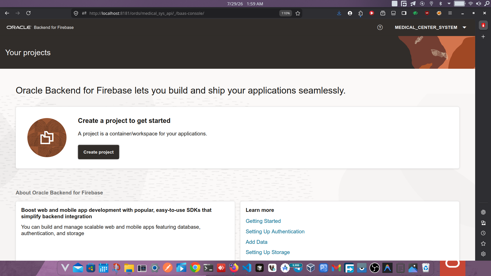

# Installing and Configuring Oracle Backend for Firebase

This document walks through the setup required to open the Oracle Backend for Firebase Console, create a project, and connect the fusabase CLI to your environment.

## 1. Prepare the Database

The installer (`npm run install`) handles this automatically:

1. **Version Check**: Ensures `COMPATIBLE` is >= 23.9.0.
2. **Extended Strings**: Checks `MAX_STRING_SIZE`. If it is `STANDARD`, the installer will attempt to automatically run the PDB upgrade sequence to enable `EXTENDED` strings.
3. **TDE Configuration**: Checks the TDE Wallet. If it's not `OPEN` and you have provided a `TDE_KEYSTORE_PASSWORD` in your `.env`, it will attempt to configure it.

## 2. Enable Oracle Backend for Firebase in ORDS

During the installation process, the installer will pause and instruct you to log into your ORDS server and run the interactive ORDS installer command:

```bash
ords --config /opt/ords-config fusabase install
```

You must complete this interactive step manually, as it requires ORDS administrative access.


## 3. Prepare and Enable the Project Schema

After confirming the ORDS step, the installer resumes and automatically:

1. Creates the project schema and tablespace.
2. Grants `CREATE SESSION` and `RESOURCE`.
3. (Optional) Grants `DBFS_ROLE` if configured.
4. Connects as your designated DBA user and runs `OBAAS_ADMIN.OBAAS_ENABLE_SCHEMA()` to register the schema.

## 4. Open the Console

Once complete, the installer will output your Console URL. It will look like:

```text
http://localhost:8080/ords/_/fusabase_user/_baas-console/
```

Open this URL, sign in with your project schema credentials, and click **Create Project**.



## 5. Configure the CLI

Run `npm run configure-cli` to generate a `fusabase.config.js` file and view instructions on creating an OAuth client in Database Actions to authenticate the `fusabase-cli`.
